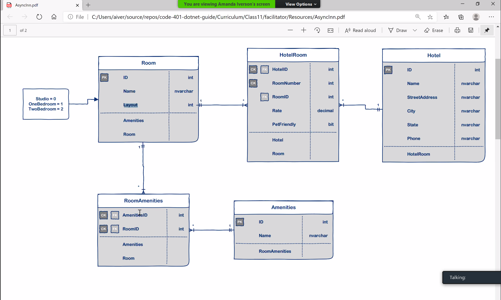
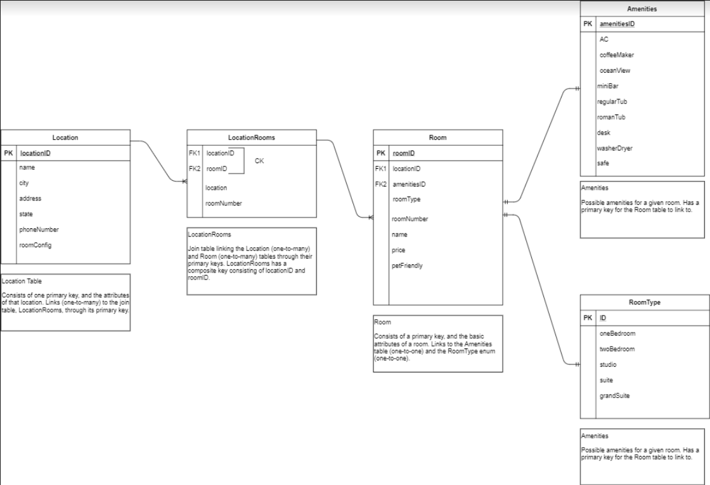

# Async-Inn

## Author
*Michael Refvem*

## Description
The owners of “Async Inn” have approached you with plans to renovate their hotel chain. Currently they are tracking all the different locations and rooms in spreadsheets and binders. They currently have about 10 binders full of paperwork that consists of the difference between each location and the pricing for each room. The amount of time and paperwork it takes to manage the rooms and locations is costing the company both time and money. They are currently looking for a “better way” to maintain their business model.

## Architecture

This app is an API containing data about hotels stored in a Database. Originally this was accomplished by having the controllers depend on the db context but in a later version was moved over to using interfaces instead. This was done because it allows the way for information to be stored and accessed from the database to be more dynamic in later versions (having a narrower mode of access could cause problems later). Using interfaces allows our classes to follow directions rather than creating directions themselves. This makes future changes to the app easier later.

---

### Getting Started
Clone this repository to your local machine.

```
$ git clone https://github.com/MRefvem/Async-Inn.git
```

### To run the program from Visual Studio:
Select ```File``` -> ```Open``` -> ```Project/Solution```

Next navigate to the location you cloned the Repository.

Double click on the ```Lab-Hotel-Asset-Management``` directory.

Then select and open ```Async-Inn.sln```

---

### Visuals

#### Entity Relationship Diagram (ERD) (Revised - 21 Jul 2020)

#### Entity Relationship Diagram (ERD) (Original - 20 Jul 2020)


### Amenities Routes
- GET: api/Amenities - Get a list of all amenities
- GET: api/Amenities/{id} - Get an amenity by ID
- PUT: api/Amenities/{id} - Update an amenity by ID
- POST: api/Amenities - Create a new amenity
- DELETE: api/Amenities/{id} - Delete an amenity by ID

### Hotels Routes
- GET: api/Hotels - Get a list of all hotels
- GET: api/Hotels/{hotelId} - Get a hotel by ID
- PUT: api/Hotels/{hotelId} - Update a hotel by ID
- POST: api/Hotels - Create a new hotel
- POST: {hotelId}/{roomId}/Rooms - Create a new hotel room
- GET: api/Hotels/{hotelId}/Rooms/{roomNumber} - Get details on a specific room
- GET: api/Hotels/{hotelId}/Rooms - Get details on all rooms in a specific hotel
- PUT: api/Hotels/{hotelId}/Rooms/{roomNumber} - Update room details
- DELETE: api/Hotels/{hotelId}/Rooms/{roomNumber} - Delete a hotel room
- DELETE: api/Hotels/{hotelId} - Delete a hotel

### Rooms Routes
- GET: api/Rooms - Get a list of all rooms
- GET: api/Rooms/{id} - Get a room by ID
- PUT: api/Rooms/{id} - Update a room by ID
- POST: api/Rooms - Create a new room
- POST: {roomId}/{amenityId} - Add an amenity to a room
- DELETE: {roomId}/{amenityId} - Delete an amenity from a room
- DELETE: {roomId} - Delete a room

### Identity and how it's used in this Application
Identity is the concept of creating user accounts and authentication. ASP.NET Core Framework has build in Identity tools that help keep user information safe when it is passed into a DataBase. Usernames and Passwords are sent in by the user and through a process known as Hashing the information is converted into abstract code that is all but impossible to descipher.

This application has a class, ApplicationUser, that enables the application to take in user information and register an account that the user can login to later with their credentials.

### Authorization and how it's used in this Application
Authorization is the ability to add permission layers to different operations in an application. Certain users will be granted roles with higher levels of authorizations than others. For the same reasons you would never let your customers be in charge of creating new entities in your business, the same rules apply in relation to these authorization roles.

The four roles contained within this app are:
- District Manager: District manager can do full CRUD operations on all Hotel, HotelRoom, Room, and Amenity entities. The district manager can create accounts for all other roles.
- Property Manager: Property managers can add/upp/read new HotelRooms to hotels, and amenities to rooms. A property manager cannot create new room entities or hotel entities. The property manager can only create accounts for agents.
- Customer Agent: an agent can only update/read a HotelRoom and add/delete amentities to rooms.
- Customer: anonymous users can only view all hotel information DTO.

There are three Application Role Policies:
- [Authorize(Policy = "MaxPrivileges")]: operations only the District Manager has access to.
- [Authorize(Policy = "ElevatedPrivileges")]: operations only the District Manager and Property Manager have access to.
- [Authorize(Policy = "NormalPrivileges")]: operations only the District Manager, Property Manager and Customer Agent have access to.

For operations that allow all users, we use the [AllowAnonymous] access layer.

---

### Change Log 
7.0: *Added new roles to the application: District Manager, Property Manager, Customer Agent and Customer. Application users can perform different tasks based on their assigned roles and have the ability to register and login with accounts. When a user logs into their account, the server returns a JTW token that indicates the user's role and with that their abilities. Unit tests written/passing for the Amenities routes, covering all of the public methods.* - 1 Aug 2020
6.0: *Created new class, ApplicationUser. Updated AsyncInnDBContext to read ApplicationUser and derive from Identity. Updated database to integrate Identity tables. Registered Identity into Startup file "services.AddIdentity...". Created an Account Controller and added both Register and Login actions. Confirmed that you can register a user successfully in the database. Confirmed that you can login with the credentials of an existing user.* - 28 Jul 2020
5.0: *Added Data Transfer Objects (DTOs) for all four services. Updated all Controllers and Repositories to read from the DTOs.* - 27 Jul 2020
4.0: *Built navigation properties and routes. Created new interfaces, services and tables for RoomAmenities and HotelRooms. Added the ability to add and remove amenities to a specific room. Satisfied CRUD requirements. README updated.* - 23 Jul 2020
3.1: *README updated, .gitignore added* - 22 Jul 2020
3.0: *Refactored, Hotels, Rooms and Amenities controllers to depend on an interface rather than the db context. Built an interface for each of the controllers that contain the required method signatures for all four CRUD operations to the database directly. Updated each of the controllers to inject the interface rather than the DBContext. Create a service for each of the controllers that implement the appropriate interface.* - 22 Jul 2020
2.2: *README updated, includes revised ERD* - 21 Jul 2020  
2.1: *All feature tasks complete, was able to replicate all CRUD operations in Postman* - 21 Jul 2020  
2.0: *Async Inn Management System, application specifications: Startup File, Simple Models & the Database, Seeded Data* - 21 Jul 2020  
1.2: *Added ERD to project (planning database stage)* - 20 Jul 2020  
1.1: *Initial commit* - 20 Jul 2020